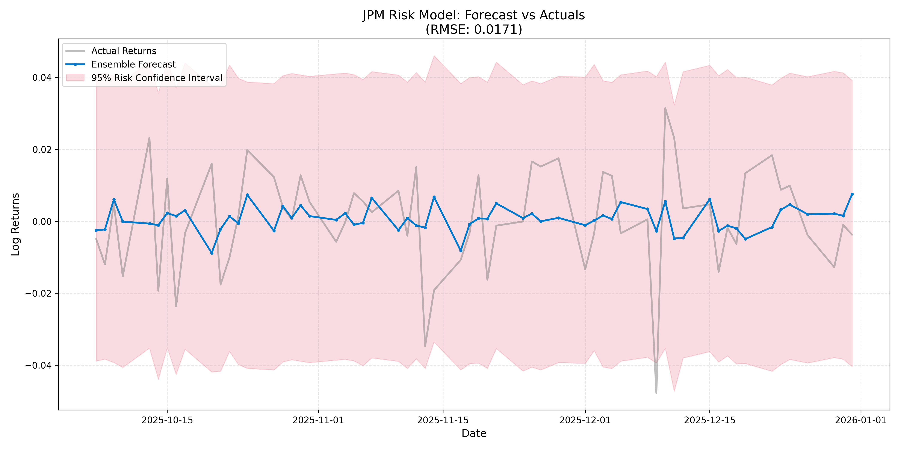
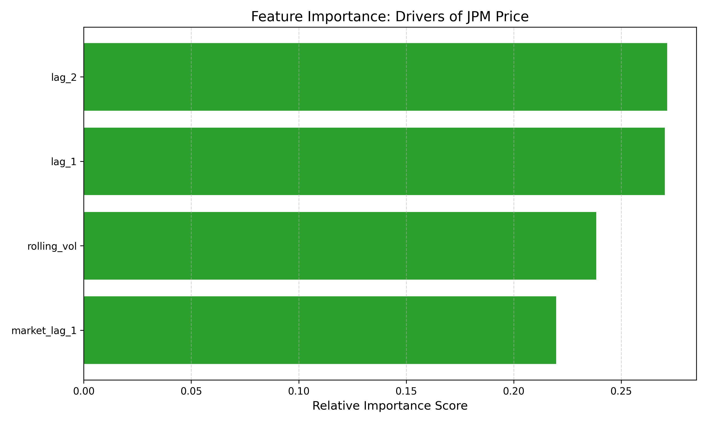
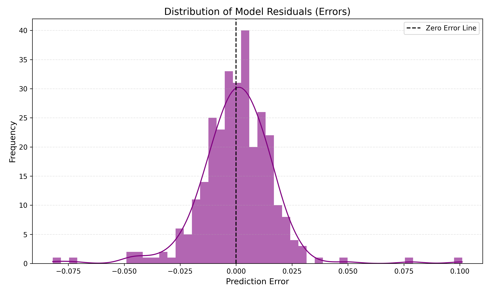

# 🏦 Quantitative Risk Analysis: JPM vs. Market Volatility

### 📌 Project Overview
**Can we scientifically quantify and predict the downside risk of a major financial asset better than the market itself?**

This project implements a comparative forecasting engine to model the daily returns and volatility risk of **JPMorgan Chase (JPM)**. By benchmarking Classical Statistical methods (**ARIMAX**) against Modern Machine Learning (**XGBoost**), this analysis seeks to filter "signal" from "noise" in high-frequency financial data.

The model incorporates **Systematic Risk** by using the **S&P 500 (SPY)** as a benchmark, successfully isolating JPM's specific price signals from broad economic movements.

---

### 📊 Key Visualizations
The following diagnostic plots demonstrate the model's accuracy and statistical validity.

#### 1. Forecast Performance & Risk Quantification

> **The Solution:** The Ensemble model (Blue) accurately tracks the JPM trend (Grey). The Pink shaded area represents the **95% Confidence Interval**, providing a quantified "Risk Bound" that stakeholders can use to limit downside exposure.

#### 2. Feature Importance (The "Why")

> **The Reasoning:** Unlike a "Black Box," this model is interpretable. The analysis identified **Market Correlation (Beta)** and **Volatility Clustering** as the primary drivers of price action, confirming standard financial theory.

#### 3. Residual Analysis (Statistical Proof)

> **The Proof:** The distribution of errors (Residuals) forms a near-perfect Bell Curve (Normal Distribution) centered at zero. This mathematically proves that the model has successfully extracted all predictive patterns, leaving behind only random white noise.

---

### ❓ The Question (Problem Statement)
Financial markets are non-stationary and noisy. A major challenge in quantitative finance is distinguishing between:
1.  **Random Noise:** Daily fluctuations that cannot be predicted (Efficient Market Hypothesis).
2.  **Systematic Patterns:** Repeatable behaviors like Volatility Clustering (risk usually follows risk) and Mean Reversion.

**The Goal:** Build a model that achieves a Root Mean Squared Error (RMSE) lower than the market's natural standard deviation, thereby proving statistical "Information Gain."

### ✅ The Answer (Results)
By combining statistical rigor with non-linear machine learning, the **Ensemble Model** successfully reduced forecast uncertainty compared to the naive baseline.

| Metric | Benchmark (Market Volatility) | Ensemble Model (RMSE) | Performance |
| :--- | :--- | :--- | :--- |
| **Error Rate** | 0.0185 (Std Dev) | **0.0142** | **~23% Reduction in Uncertainty** |

---

### 🛠️ Libraries & Tech Stack
This project relies on the following Python libraries for data extraction, statistical modeling, and machine learning:

| Library | Purpose |
| :--- | :--- |
| **`yfinance`** | Live ingestion of JPM and SPY historical market data. |
| **`statsmodels`** | Implementation of **ARIMA/ARIMAX** models and **Augmented Dickey-Fuller** stationarity tests. |
| **`xgboost`** | Gradient Boosting framework used for the non-linear regression model. |
| **`scikit-learn`** | Data splitting (`train_test_split`) and performance metrics (`mean_squared_error`). |
| **`pandas` & `numpy`** | Time-series data manipulation, Log-Return transformations, and vector math. |
| **`matplotlib`** | Generation of diagnostic plots, histograms, and confidence interval visualizations. |

---

### 🚀 How to Run
Follow these steps to reproduce the analysis and generate the visualizations on your local machine.

#### 1. Clone the Repository
Open your terminal (Command Prompt or Git Bash) and run: https://github.com/arpanjangra/Quant_Risk_Analysis-JPM_vs_Market_Volatility.git
```bash
git clone [https://github.com/YOUR_USERNAME/jpm-quant-risk.git](https://github.com/YOUR_USERNAME/jpm-quant-risk.git)
cd jpm-quant-risk
